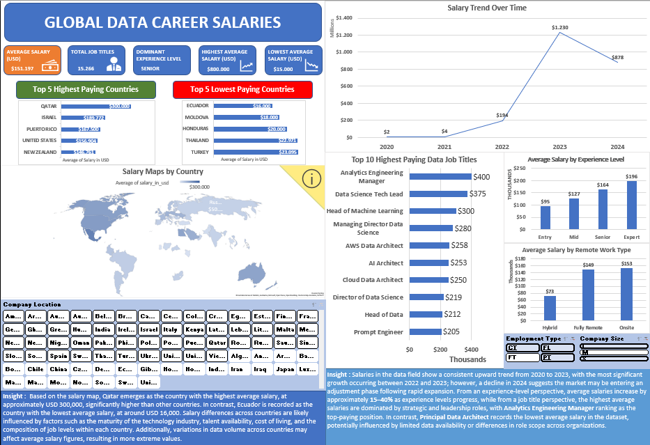

# Global Data Career Salaries Dashboard

## 📊 Overview
This project analyzes global salary data for data-related roles across different countries using Microsoft Excel.

## 🔍 Key Analysis
- Salary comparison across countries (highest vs lowest)
- Year-over-year salary trends
- Salary distribution by role, experience level, and work type

## 🛠 Tools Used
- Microsoft Excel (Pivot Tables, Power Query, Slicers)
- Data Visualization (Charts & Maps)

## 📈 Key Insights
- Significant salary differences across countries
- Higher experience levels lead to higher salary ranges
- Salary trends show growth followed by market adjustment

## 📂 Files
- `global-salary-dashboard.xlsx` → Main dashboard
- `dashboard-preview.png` → Dashboard preview

## 🖼 Dashboard Preview

## 📌 Note
Download the Excel file to interact with the dashboard.
